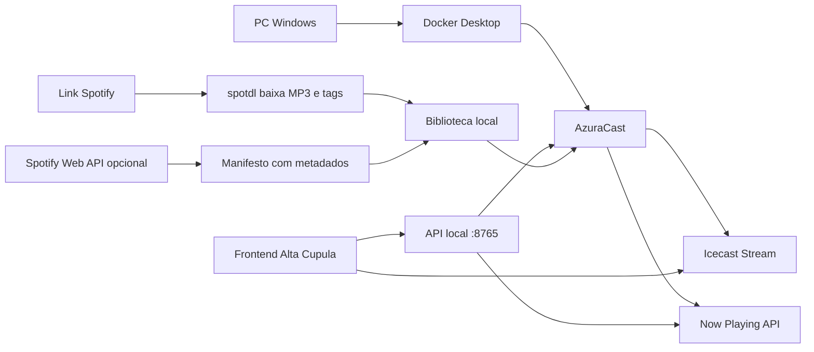

# RadioPoggers / Alta Cupula

Radio privada local-first: AzuraCast no Docker, interface propria **Alta Cupula** (HTML/CSS/JS) e API Python para importar playlists Spotify via spotdl.

## O que este projeto entrega

- Transmissao e automacao com AzuraCast, Icecast e Docker.
- Site **Radio no Grale** (logo RG): player rock/industrial, HLS, progresso, historico, animacao ASCII, voice drop, narradora **Miku** (global) e **Hoshino** (opt-in, Gemini Kore) com legenda digitada e ASCII falando.
- API local enriquece Now Playing (sync auto, `song_history`, manifesto, voice drop, locucoes Miku).
- Importacao Spotify pelo botao **Tocar** no frontend (spotdl + sync AzuraCast).
- Guias em portugues para Windows, audio legal, VPS e tunnel.

## Arquitetura



## Estrutura

```text
RadioPoggers/
  apps/radiopoggers_app/    App nativo Flutter (Windows + Android, sem npm)
  docs/                     Guias de instalacao, audio legal, app e VPS
  frontend/                 Site player em HTML, CSS e JS puro
  infra/azuracast/          Notas e templates para AzuraCast Docker
  library/                  Inbox/Managed de audios locais autorizados
  scripts/                  Atalhos PowerShell (radio, frontend, API, sync)
  tools/query_azuracast_db.py Consultas SQL no MariaDB do AzuraCast
  tools/radiopoggers-server/API local para baixar/importar playlists pelo frontend
  tools/spotify-metadata/   Importador/pareador Python sem dependencias externas
```

## Inicio rapido

| Guia | Uso |
| --- | --- |
| **`docs/LIGAR_DESLIGAR.md`** | Comandos para **ligar e desligar** tudo (Docker, API, site) |
| **`docs/GUIA_COMPLETO.md`** | Documentacao **completa** de funcionalidades |
| **`docs/RUNBOOK_ATUAL.md`** | URLs, portas, troubleshooting do dia a dia |
| **`docs/APP_OUVINTE.md`** | Instalar app (exe/APK), Radmin, updates — guia para amigos |
| **`docs/APP_FLUTTER.md`** | App Flutter: dev, build, arquitetura |
| **`docs/APP_FEATURES.md`** | Lista completa de funções do app |
| **`docs/APP_RELEASE.md`** | Versionamento, GitHub Releases, auto-update |
| **`docs/RADMIN_OUVINTES.md`** | Convidar ouvintes na VPN |

### App nativo (sem navegador)

```powershell
.\scripts\start-full-stack.ps1
.\scripts\start-app-dev.ps1
```

Build: `.\scripts\build-app-windows.ps1` · `.\scripts\build-app-android.ps1`

```powershell
.\scripts\check-env.ps1
.\scripts\start-full-stack.ps1 -OpenBrowser
# ou manual: start-local-api.ps1 + serve-frontend.ps1 -Open
.\scripts\test-radiopoggers.ps1
```

Abra `http://localhost:5500/frontend/` (Ctrl+F5 se cache antigo).

Para a radio real:

1. Docker Desktop + AzuraCast (`docs/SETUP_WINDOWS.md`).
2. Estacao `radio-no-grale` no painel.
3. `frontend/config.js` ja aponta para localhost e API local.
4. Opcional: `.\scripts\fix-azuracast-station.ps1` apos primeira importacao.

Parar servicos locais: `.\scripts\stop-local-stack.ps1` — parar AzuraCast: `.\scripts\stop-radio.ps1`

Atalho para instalar AzuraCast depois de configurar o Ubuntu WSL pela primeira vez:

```powershell
.\scripts\install-azuracast-wsl.ps1
```

## Playlist pelo Frontend (botao Tocar)

```powershell
python -m pip install --upgrade spotdl
.\scripts\serve-frontend.ps1 -Open
.\scripts\start-local-api.ps1
```

No site, secao **Playlist importada**: cole o link Spotify e clique **Tocar**. O formulario bloqueia ate terminar (nao envie outro link no meio).

Fluxo:

1. Frontend → `POST http://127.0.0.1:8765/api/import-spotify`
2. spotdl baixa para `library/Inbox/Spotdl`
3. Manifesto `data/spotify-imported.json` (rescan marca `ready` se arquivo existe)
4. Sync para AzuraCast `imported/`, playlist `default`, `avoid_duplicates = 0`
5. **Estante de discos** atualiza automaticamente no site (nao precisa recarregar manualmente)

Metadados Now Playing: API local faz sync automatico; manual: `.\scripts\sync-nowplaying.ps1`.

Para acesso fora de casa, siga `docs/MIGRACAO_VPS.md` e comece pela parte de Cloudflare Tunnel.

## Guias

- `docs/GUIA_COMPLETO.md`: documentacao consolidada de todas as funcionalidades.
- `docs/LIGAR_DESLIGAR.md`: comandos para ligar e desligar Docker, API, frontend e VOICEVOX.
- `docs/RUNBOOK_ATUAL.md`: estado atual funcionando, URLs, portas, scripts, troubleshooting e fluxo de operacao.
- `docs/MELHORIAS_PLAYER_E_MIKU.md`: voice drop, HLS, ducking sidechain, visual ASCII/ondas, narradora Miku (changelog detalhado).
- `docs/MIKU_NARRATOR.md`: instalacao VOICEVOX, katakana PT, prosodia, variaveis e API da Miku.
- `docs/HOSHINO_NARRATOR.md`: narradora opt-in Gemini Kore, tuning de voz, ASCII legenda, API.
- `docs/VOTACAO_OUVINTES.md`: votacao em tempo real, skip, pedidos, sorteio rock.
- `docs/SETUP_WINDOWS.md`: instalacao local com Docker Desktop e WSL2.
- `docs/LEGAL_AUDIO.md`: regras praticas para usar musicas sem depender de download indevido.
- `docs/SPOTIFY_METADATA.md`: uso da Spotify Web API apenas para metadados.
- `docs/LOCAL_LIBRARY.md`: organizacao local, deduplicacao e playlists M3U.
- `docs/CLOUDFLARE_TUNNEL.md`: publicar para amigos sem abrir portas no roteador.
- `docs/MIGRACAO_VPS.md`: caminho para sair do PC e ir para uma VPS.
- `docs/APP_WRAPPER.md`: PWA agora e wrapper nativo futuro.

## Importante sobre Spotify e spotdl

O `spotdl` usa o link do Spotify como referencia e busca audio correspondente em fontes externas como YouTube. A responsabilidade pelo direito de baixar e transmitir cada faixa continua sendo sua. Para uma radio publica, privada ou semi-publica, use somente conteudo licenciado/autorizado.

Veja `docs/LEGAL_AUDIO.md` antes de colocar a radio no ar para qualquer publico, mesmo que pequeno.

## Sem npm

O frontend nao usa npm, bundler, React, Vite ou dependencias instaladas por gerenciador de pacotes JavaScript. A API local usa Python e chama o `spotdl` instalado no ambiente para baixar as faixas.

