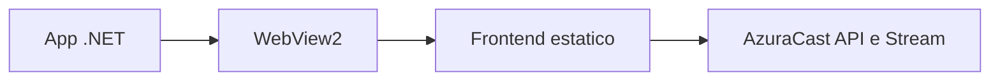

# Caminho Para App Nativo

A primeira versao da RadioPoggers e uma PWA: abre no navegador, pode ser instalada e usa controles de midia nativos quando o navegador suporta.

## Por que PWA primeiro

- Nao precisa loja de apps.
- Nao precisa npm.
- Reaproveita exatamente o frontend.
- Funciona em desktop e celular.
- E mais leve para rodar no PC.

## App Flutter (Windows + Android)

Implementado em `apps/radiopoggers_app/` — UI nativa, sem npm. Guia: **`docs/APP_FLUTTER.md`**.

```powershell
.\scripts\start-app-dev.ps1
.\scripts\build-app-windows.ps1
```

## Windows app WebView2 (alternativa legada)

Para empacotar no Windows sem npm, a opcao mais direta e um app .NET com WebView2.

Arquitetura futura:



O wrapper nativo teria pouca logica:

- Abrir `frontend/index.html` ou URL hospedada.
- Permitir tela sem bordas opcional.
- Usar icone proprio.
- Criar instalador Windows, se necessario.

## Android/iOS no futuro

Para celular, comece instalando a PWA pelo navegador.

Empacotamento nativo pode vir depois, mas normalmente exigira ferramentas especificas de cada plataforma. O projeto deve manter a regra: o frontend principal continua em HTML/CSS/JS puro.

## Requisitos para boa PWA

- Servir por `http://localhost` em desenvolvimento.
- Servir por HTTPS quando estiver publico.
- Ter `manifest.webmanifest`.
- Ter `sw.js`.
- Ter icones.
- O audio deve iniciar por clique/toque do usuario por causa das politicas de autoplay.

