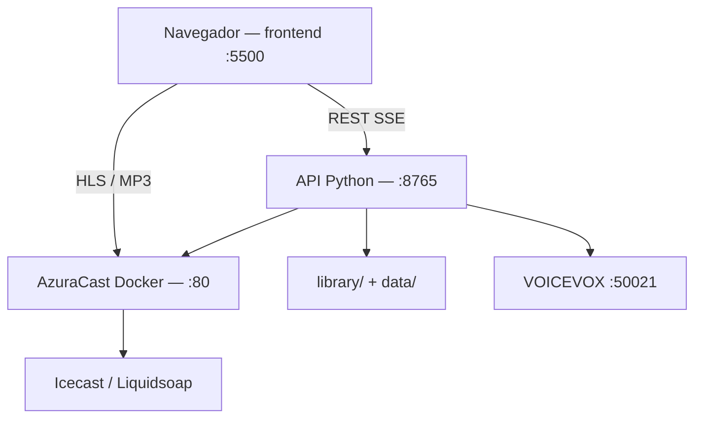

# Guia completo — RadioPoggers / RADIO NO GRALE

Documentacao consolidada de tudo que foi implementado no projeto: arquitetura, funcionalidades, arquivos, fluxos e referencias aos guias especializados.

**Ultima atualizacao:** junho 2026 (Hoshino, estante/preview, modal narradoras, ajustes voz).

---

## Indice de documentacao

| Documento | Conteudo |
| --- | --- |
| **`LIGAR_DESLIGAR.md`** | Comandos para subir/parar Docker, AzuraCast, API, frontend, VOICEVOX |
| **`RUNBOOK_ATUAL.md`** | URLs, portas, config, troubleshooting do dia a dia |
| **`SETUP_WINDOWS.md`** | Instalacao inicial Windows + WSL + AzuraCast |
| **`MELHORIAS_PLAYER_E_MIKU.md`** | HLS, progresso, voice drop, ducking, Miku, ASCII |
| **`MIKU_NARRATOR.md`** | VOICEVOX, katakana, frases, variaveis |
| **`HOSHINO_NARRATOR.md`** | Narradora opt-in Gemini Kore, voz, ASCII, tuning |
| **`VOTACAO_OUVINTES.md`** | Regras de voto, endpoints, sorteio |
| **`LOCAL_LIBRARY.md`** | Catalogo, preview, pedidos |
| **`SPOTIFY_METADATA.md`** | Manifesto e metadados |
| **`LEGAL_AUDIO.md`** | Uso legal de audio |
| **`MIGRACAO_VPS.md`** | Deploy em servidor |
| **`CLOUDFLARE_TUNNEL.md`** | Expor o site na internet |
| **`APP_WRAPPER.md`** | PWA / instalacao |
| **`APP_OUVINTE.md`** | App nativo: instalar exe/APK, Radmin, updates para amigos |
| **`APP_FEATURES.md`** | Funcionalidades do app Flutter |
| **`APP_RELEASE.md`** | Releases GitHub e auto-update |
| **`RADMIN_OUVINTES.md`** | Convidar ouvintes na VPN Radmin |

---

## App ouvinte (Flutter)

Amigos ouvem a rádio pelo app **Windows/Android** na rede **Radmin**, com chamadas de voz, estante e atualizações via **GitHub Releases**. Guia principal: **`docs/APP_OUVINTE.md`**.

---

## Arquitetura



---

## Stack tecnica

| Camada | Tecnologia |
| --- | --- |
| Transmissao | AzuraCast, Icecast, Liquidsoap, Docker (WSL2) |
| Site | HTML, CSS, JS puro, Service Worker, hls.js |
| API | Python `http.server` + modulos auxiliares |
| Import | spotdl, manifesto JSON, sync AzuraCast |
| Voz Miku | VOICEVOX (preferido) ou edge-tts |
| Voz Hoshino | Gemini TTS Kore (opt-in por navegador) |
| Votacao | `vote_system.py`, SSE, AzuraCast API key |

---

## Frontend — funcionalidades

### Player e stream

- Marca **RADIO NO GRALE** (logo RG), UI rock/industrial.
- Stream principal **HLS** (`streamMode: "hls"`); MP3 fallback.
- Barra de progresso com compensacao de latencia HLS (`streamProgressLatencySec: 0` = auto).
- Poll Now Playing a cada 3s via API local (`localApiUrl`).
- Historico de faixas; capa com fallback SVG.
- Recuperacao de stream: swap de elemento audio, reconnect HLS, monitor de buffer.
- Demo mode quando AzuraCast indisponivel (`demoMode: "auto"`).

### Animacao ASCII (fundo)

| Modo | Quando | Asset |
| --- | --- | --- |
| **play** | Stream tocando (ou demo audio) | `ascii-frames.json` (guitarrista) |
| **idle** | Online, player pausado | `ascii-frames sentado.json` |
| **off** | Estacao offline (`is_online: false`) ou API NP inacessivel | `ascii-frames off.json` (+ GIF fallback) |

Implementacao: `frontend/ascii-guitarist.js`, loop em `frontend/app.js` (`resolveAsciiMode`, `refreshAsciiBackdropMode`).

### Audio reativo e voice drop

- Canvas de ondas no canto inferior direito (analise do stream).
- **Voice drop:** gravar pelo microfone, EQ estilo FM, upload `POST /api/voice-drop`.
- Ducking sidechain: musica abaixa durante locucao do ouvinte ou da Miku.
- Volume unificado: Miku e voice drop no mesmo grafo do slider do player.

### Narradora Miku

- Locucao automatica em troca de faixa (delay ~10s apos mudanca).
- Bumper no meio da musica (~58% do tempo).
- Portugues via katakana para VOICEVOX (`pt_katakana.py`).
- Legenda digitada em `#streamMessage` + ASCII falando (`ascii-frames falando.json`).
- Hold 5s apos a voz; animacoes de entrada/saida do painel.
- Config: `mikuNarratorEnabled`, `mikuVoiceDetuneCents`.

### Narradora Hoshino (opt-in)

- Escolha no modal **Narradora** (Miku global vs Hoshino so neste navegador).
- Motor **Gemini Kore**; key em `data/gemini-api-key.txt`.
- Cliente agenda locucoes via `narrator_hints`; ignora drops globais da Miku.
- Legenda roxa + ASCII **`ascii-frames hoshino falando.json`** (mesmo tamanho da Miku).
- Velocidade: `hoshinoVoicePlaybackRate` (frontend) + `RADIOPOGGERS_HOSHINO_SPEED_FACTOR` (API).
- Guia completo: **`docs/HOSHINO_NARRATOR.md`**.

### Votacao ao vivo

Tipos: `skip_track`, `library_request`, `spotify_import`.

| Audiencia | Comportamento |
| --- | --- |
| Sozinho no site | Votacao solo ~6s no overlay; proposer pode votar mesmo com radio pausada |
| 2+ no site | Overlay coletivo ~20s; empate = sorteio rock server-side |
| Pular faixa (solo) | Modal direto rapido (excecao) |
| Pedir na estante / Spotify | **Sempre** overlay de votacao (nao modal direto) |

Ver `docs/VOTACAO_OUVINTES.md`.

### Biblioteca local (estante de discos)

- Painel com busca, filtros artista/album, paginacao.
- Catalogo via `GET /api/library` (cache no servidor; refresh opcional `?refresh=1`).
- Auto-refresh a cada 15s (`libraryAutoRefreshMs`) + apos import Spotify.
- Fallback estatico `library-catalog.json` se API lenta.
- **Ouvir:** preview local (`/api/library/preview/{id}`) — so o ouvinte, nao vai ao ar; barra “Previa local”.
- **Pedir na radio:** botao **Pedir** em cada faixa da estante e em **Minha playlist** → votacao → **Tocar ja** ou **Na fila**.
- **Minha playlist:** localStorage; pedido por faixa individual.
- Fallback estatico `library-catalog.json` se API lenta; **`probeLocalApiBase()`** resolve URL da API (LAN vs 127.0.0.1).
- Import Spotify: `inspect` reutiliza playlist ja baixada; job assincrono com status.

Detalhes preview/pedidos: **`docs/LOCAL_LIBRARY.md`**.

### Import Spotify (botao Tocar)

1. Valida URL Spotify.
2. `GET /api/import-spotify/inspect` — se ja importada, modal/votacao sem redownload.
3. Senao `POST /api/import-spotify` (job, spotdl, manifesto, sync AzuraCast).
4. Apos import: votacao se 2+ ouvintes; senao escolha tocar ja / so fila.

### PWA

- Service Worker `sw.js` (cache estatico **v24+**); inclui frames Miku/Hoshino falando e assets ASCII.

---

## Modal escolha de narradora (jun/2026)

- Botao **Narradora** no player; modal estilo votacao (largura ate ~920px).
- Cards Miku / Hoshino com ASCII animado no picker (`ascii-frames miku.json` / `hoshino.json`).
- Preferencia: `localStorage` `radiopoggers_narrator`.
- Arquivos: `frontend/index.html`, `app.js`, `styles.css`, `ascii-guitarist.js`.

---

## API local — endpoints

Base: `http://127.0.0.1:8765`

| Metodo | Rota | Funcao |
| --- | --- | --- |
| GET | `/api/health` | Saude da API |
| GET | `/api/nowplaying` | NP enriquecido + voice_drop + audience_vote |
| GET | `/api/manifest` | Manifesto com rescan |
| GET | `/api/library` | Catalogo (busca, filtros, cache) |
| GET | `/api/library/filters` | Artistas/albuns |
| GET | `/api/library/meta` | Meta do catalogo (revisao) |
| GET | `/api/library/preview/{id}` | Stream MP3 preview |
| POST | `/api/library/request` | Pedido na fila AzuraCast |
| GET | `/api/import-spotify/inspect` | Playlist ja importada? |
| GET | `/api/import-spotify/status` | Status do job |
| POST | `/api/import-spotify` | Inicia import |
| POST | `/api/voice-drop` | Upload chamada |
| GET | `/api/voice-drop/active` | Drop ativo |
| GET | `/api/voice-drop/file/{id}` | Arquivo |
| GET | `/api/miku/status` | TTS / VOICEVOX |
| POST | `/api/miku/narrate` | Debug locucao Miku |
| GET | `/api/hoshino/status` | Gemini / Kore |
| POST | `/api/hoshino/narrate` | Gera locucao Hoshino (cliente) |
| POST | `/api/audience/heartbeat` | Presenca |
| GET | `/api/audience/count` | Contagem |
| POST | `/api/vote/start` | Abre votacao |
| POST | `/api/vote/cast` | Voto |
| POST | `/api/vote/execute-direct` | Acao imediata (1 ouvinte, ex. pular) |
| GET | `/api/vote/active` | Votacao ativa |
| GET | `/api/vote/events` | SSE |

Modulos:

```text
tools/radiopoggers-server/server.py      — HTTP, import, library, AzuraCast
tools/radiopoggers-server/vote_system.py — votacao + SSE
tools/radiopoggers-server/miku_narrator.py
tools/radiopoggers-server/hoshino_narrator.py
tools/radiopoggers-server/gemini_narrator.py
tools/radiopoggers-server/pt_katakana.py
```

---

## Dados e pastas

```text
library/Inbox/              Entrada manual
library/Inbox/Spotdl/       Downloads spotdl
library/Managed/            Organizado
data/spotify-imported.json  Ultima importacao
data/library-catalog.json   Catalogo global deduplicado
data/azuracast-api-key.txt  Chave API (nao commitar)
data/gemini-api-key.txt     Chave Gemini Hoshino (nao commitar)
frontend/config.js          Config do player
~/azuracast/                Instalacao Docker AzuraCast (WSL)
```

---

## Scripts PowerShell

| Script | Funcao |
| --- | --- |
| `check-env.ps1` | Verifica python, docker, spotdl, wsl |
| `start-radio.ps1` | Sobe AzuraCast |
| `stop-radio.ps1` | Para AzuraCast |
| `start-full-stack.ps1` | Sobe tudo (atalho) |
| `stop-local-stack.ps1` | Para API, frontend, VOICEVOX (portas) |
| `serve-frontend.ps1` | HTTP :5500 |
| `start-local-api.ps1` | API :8765 + key + VOICEVOX |
| `start-voicevox-engine.ps1` | VOICEVOX :50021 |
| `test-radiopoggers.ps1` | Testes HTTP automaticos |
| `enable-azuracast-hls.ps1` | HLS no painel |
| `sync-nowplaying.ps1` | Sync metadados |
| `fix-azuracast-station.ps1` | Playlist + avoid_duplicates |
| `open-radio.ps1` | Abre URLs |

Testes Python: `scripts/test-radiopoggers-api.py`

---

## Testes automaticos (ultima execucao)

Com API, AzuraCast, frontend e assets no disco:

```text
18 ok, 0 falha
```

Cobertura:

- Health, nowplaying, manifest, library, filters, preview audio
- Miku status, voice-drop active, audience, vote active
- import-spotify inspect
- Fluxo votacao (heartbeat, start, cast)
- AzuraCast nowplaying + HLS
- Frontend index.html
- Assets ASCII (play, idle, off)

Rodar de novo:

```powershell
.\scripts\test-radiopoggers.ps1
```

---

## Historico de implementacoes (sessoes recentes)

### Infra e Now Playing

- Endpoint NP por ID (`/api/nowplaying/1`); sync automatico 20s.
- Correcao metadados stale via `song_history` e fila.
- `avoid_duplicates = 0` na playlist default.
- HLS habilitado para o player web.

### Player e audio

- Marca RADIO NO GRALE, progresso sincronizado com HLS.
- Grafo Web Audio no Play; ducking sidechain.
- Voice drop com EQ broadcast.

### Miku

- VOICEVOX + katakana PT; delay ~10s na troca de faixa.
- Legenda + ASCII falando; voice_drop.caption; TTL 90s na API.
- Volume no slider principal da radio.

### Votacao

- Overlay rock, sorteio em empate, SSE/poll.
- Pedidos da estante e Spotify pos-import via votacao coletiva.
- **Tocar ja:** `play_track_immediately_on_radio()` (batch `immediate`).
- Proposer pode votar apos preview (radio pausada).
- Correcao `vote_payload` pos-import (spotify_id vs id).

### Biblioteca e estante

- Cache de catalogo (sem rebuild a cada request).
- Preview local com botao Ouvir dedicado.
- Um botao Pedir na radio para selecao + playlist pessoal.
- Refresh automatico do catalogo (15s + durante import Spotify).

### ASCII

- Modo off-air quando transmissao offline (macaco / frames off).
- GIF fallback se frames nao carregarem.
- Frames **falando** na legenda da Miku (`ascii-frames falando.json`).
- Frames **falando** na legenda da Hoshino (`ascii-frames hoshino falando.json`, celula 3px).

### Hoshino + estante (jun/2026)

- Integracao completa Hoshino: backend, modal picker, scheduler cliente, legenda roxa, votacao.
- Ajustes voz: menos risada, pausas curtas, speed 1.06 (API) + 1.13 (player), EQ mais seco.
- ASCII legenda Hoshino trocado para animacao **falando** (nao o idle grande).
- Preview estante: `probeLocalApiBase`, fix `refreshLibraryTrackUi`, play apos `canplay`.
- Pedir: botao por faixa; exige `azuracast-api-key.txt` + API via `start-local-api.ps1`.
- `start-radio.ps1`: comando Docker corrigido (`docker.sh up`, nao `start`).

### Import Spotify

- `inspect` evita redownload; modal tocar ja / fila.
- Job assincrono com acompanhamento de status; estante atualiza nas fases catalog/sync/done.

### Bot Discord (jun/2026)

- Ponte de voz no Discord: radio + Miku + ouvintes (ducking, mixer PCM).
- `/play musica:` busca biblioteca/Spotify; sync AzuraCast automatico para faixas locais.
- Ligar/desligar/reiniciar: `start-discord-bot.ps1`, `stop-discord-bot.ps1`, `restart-discord-bot.ps1`.
- Apos reiniciar o bot: `/play` de novo na call. Guia: **`docs/DISCORD_BOT.md`**.

---

## Configuracao minima (`frontend/config.js`)

```js
localApiUrl: "http://127.0.0.1:8765",
streamMode: "hls",
hlsUrl: "http://localhost/hls/radio-no-grale/live.m3u8",
voteEnabled: true,
voteDurationSec: 20,
voteSoloDurationSec: 6,
libraryAutoRefreshMs: 15000,
asciiColorMode: "mono",
mikuNarratorEnabled: true,
hoshinoVoicePlaybackRate: 1.13,
```

Chaves sensiveis (nao commitar): `data/azuracast-api-key.txt`, `data/gemini-api-key.txt`, `data/discord-bot-token.txt`, `data/spotify-api-credentials.txt`.

---

## O que nao commitar

- `data/azuracast-api-key.txt`
- `data/discord-bot-token.txt`
- `data/spotify-api-credentials.txt`
- Credenciais Spotify (env ou arquivo acima)
- Arquivos `.env` com segredos

---

## Proximos passos sugeridos

- Rodar `test-radiopoggers.ps1` apos cada mudanca na API.
- Manter `RUNBOOK_ATUAL.md` alinhado quando mudar shortcode ou portas.
- Em producao (VPS): seguir `MIGRACAO_VPS.md` + tunnel se necessario.
