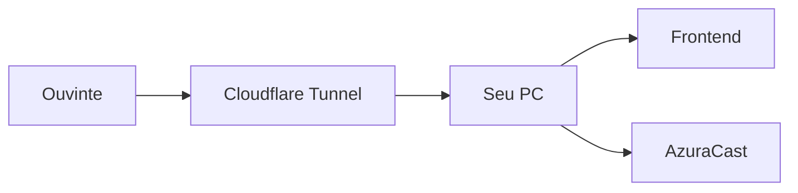

# Cloudflare Tunnel e Migracao Para VPS

Este guia deixa a RadioPoggers pronta para comecar no PC e migrar para VPS quando fizer sentido.

## Fase 1: local

Rode tudo no PC:

- AzuraCast no Docker Desktop/WSL2.
- Frontend estatico em `frontend/`.
- Acesso local por `http://localhost:8080` e `http://localhost:5500`.

Essa fase e ideal para aprender, configurar playlists e testar a interface.

## Fase 2: amigos fora da sua rede

A forma mais simples e usar Cloudflare Tunnel. Ele evita abrir portas no roteador e reduz problemas com IP dinamico.

Fluxo:



### Recomendada para inicio

- Publicar o frontend por tunnel.
- Publicar o AzuraCast apenas se necessario.
- Manter painel administrativo protegido.
- Usar senha forte e 2FA na conta Cloudflare.

### Cuidado

Se voce expuser o painel do AzuraCast, qualquer falha de senha vira risco real. Prefira expor apenas a pagina publica e o stream.

## Fase 3: VPS

Quando quiser 24h mais estavel:

1. Escolha uma VPS com Docker.
2. Instale AzuraCast seguindo o instalador oficial.
3. Configure as mesmas portas logicas.
4. Copie biblioteca, playlists e backups.
5. Ajuste `frontend/config.js` para a URL nova.
6. Aponte seu dominio ou tunnel para a VPS.

## Backup antes de migrar

No servidor atual:

```bash
cd /var/azuracast
./docker.sh backup
```

Guarde tambem:

- Arquivos de musica.
- Configuracoes de estacao.
- `.env` e `azuracast.env` se existirem customizacoes.
- `docker-compose.override.yml`, se voce tiver criado um.

## Configuracao recomendada da VPS

Para uma radio pequena:

- 1 a 2 vCPU.
- 2 GB RAM minimo, 4 GB melhor.
- 30 GB de disco ou mais, dependendo da biblioteca.
- Banda mensal compativel com ouvintes e bitrate.

Estimativa simples:

```text
consumo_por_hora = ouvintes * bitrate_kbps * 0.45 MB
```

Exemplo aproximado:

```text
10 ouvintes * 128kbps * 0.45 = 576 MB por hora
```

## URLs que mudam na migracao

No frontend, normalmente so muda `frontend/config.js`:

```js
azuracastBaseUrl: "https://radio.seudominio.com",
stationShortcode: "radiopoggers"
```

Se o stream for forçado manualmente:

```js
streamUrl: "https://radio.seudominio.com/listen/radiopoggers/radio.mp3"
```

