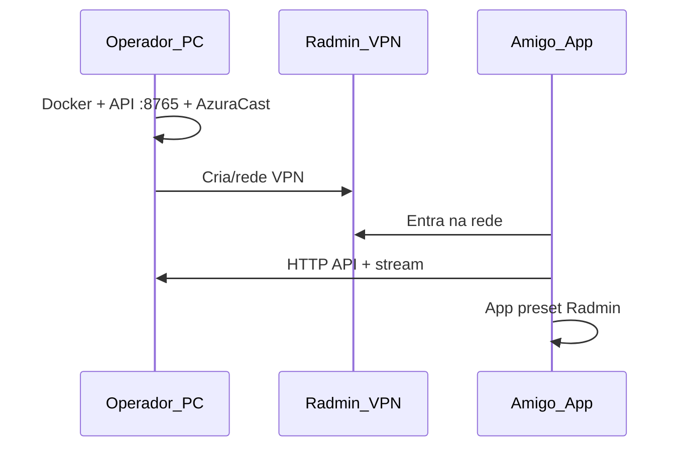

# Convidar ouvintes — Radmin VPN

Como amigos **fora da sua casa** ouvem a RADIO NO GRALE pelo app.

## Visão geral



## Passo a passo — operador

1. Instale **Radmin VPN** e crie uma rede (ou use a existente).
2. Ligue a rádio no PC:
   ```powershell
   .\scripts\start-full-stack.ps1
   ```
3. Abra firewall (Admin):
   ```powershell
   .\scripts\open-lan-firewall.ps1
   ```
4. Anote o **IP Radmin** do PC (envie aos amigos por mensagem privada — não coloque no GitHub).
5. Envie aos amigos:
   - Link da **GitHub Release** (APK ou zip Windows)
   - IP Radmin
   - Nome da rede + senha Radmin

## Passo a passo — amigo

1. Instale Radmin e entre na rede do operador.
2. Instale o app (`docs/APP_OUVINTE.md`).
3. **Mais → Usar preset Radmin** (ou Setup na primeira vez).
4. Teste **Rádio → PLAY**.

## Portas necessárias no PC da rádio

| Porta | Serviço |
| --- | --- |
| **8765** | API Python (estante, voz, voto, Spotify) |
| **80** | AzuraCast (painel + stream HTTP) |
| Stream | Porta configurada na estação (geralmente via :80) |

## IP mudou?

Se o Radmin atribuir outro IP ao operador:

1. Operador informa o novo IP.
2. Amigos: **Mais → Configuração de rede** ou **Preset Radmin** de novo.

O preset padrão no código usa um IP de exemplo — sempre confirme o IP atual na bandeja do Radmin.

## Updates sem depender do PC da rádio

- **Atualizar o app:** GitHub Releases (internet normal).
- **Ouvir rádio:** PC do operador + Radmin precisam estar ativos.

## Não é app de loja

Deixe claro para o grupo:

- É release **oficial do projeto**, distribuída por zip/APK.
- Áudio é **uso privado** entre amigos (`docs/LEGAL_AUDIO.md`).
- SmartScreen no Windows pode pedir confirmação na primeira execução.
